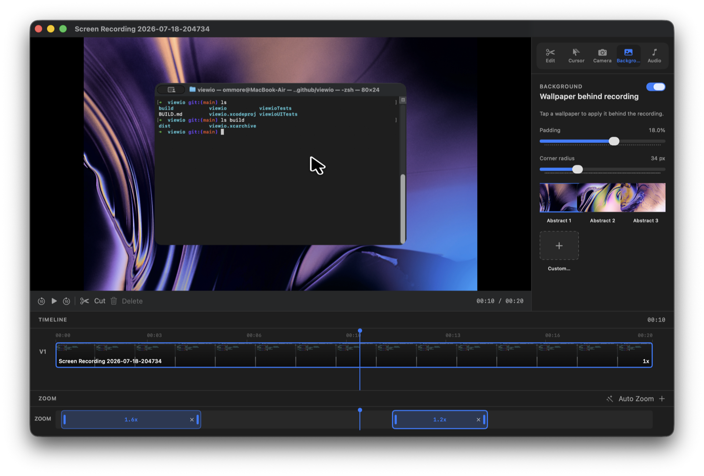
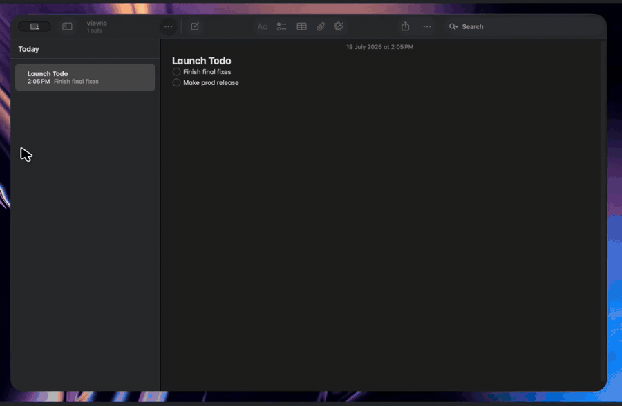
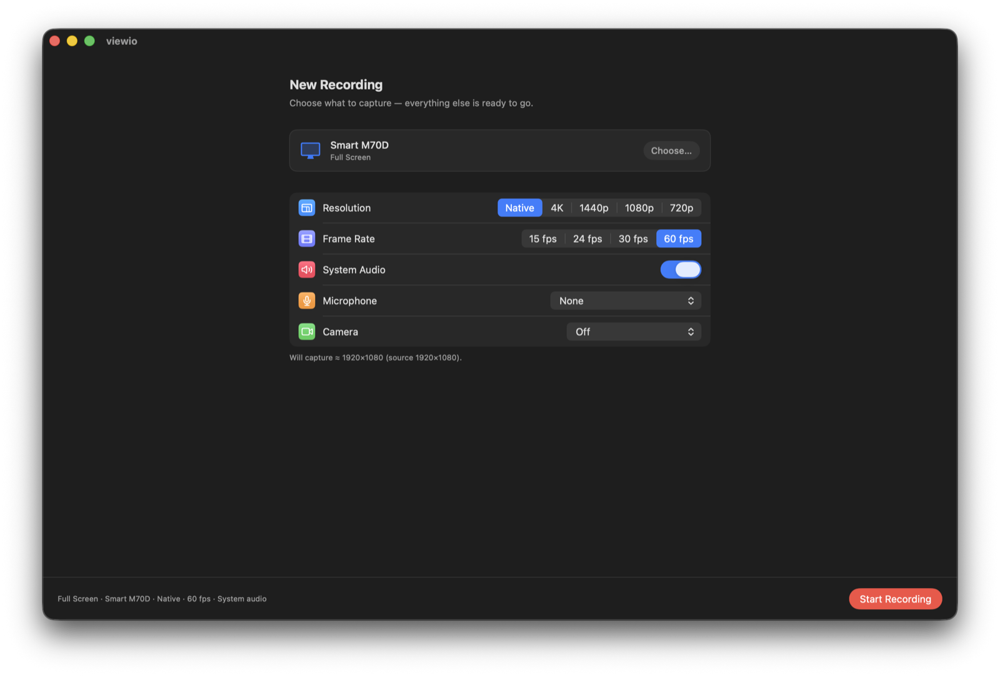

# viewio

**Cinematic screen recording for macOS.** Capture your display or a single window, then polish the take with auto zoom, a redesigned cursor, motion blur, camera PiP, and backgrounds - all in one app.

<p align="center">
  
</p>

---

## Demo

Product walkthrough — capture, edit, and export with cinematic zoom.

<p align="center">
  
</p>

<p align="center">
  <a href="docs/demo/demo.mp4">Download MP4</a>
  · GIF autoplays in the README · source in <code>docs/demo/</code>
</p>

---

## Features

### Capture

- **Full screen or window** - pick a display or app window via ScreenCaptureKit
- **Resolution** - Native, 4K, 1440p, 1080p, or 720p (never upscales past the display)
- **Frame rate** - choose what fits the demo
- **System audio** and **microphone** - optional, independently
- **Camera picture-in-picture** - live overlay while recording; corner snaps for a clean frame
- **Menu bar control** - stop or discard without hunting for the main window

### Edit

- **Cinematic auto zoom** - clusters clicks and dwells into smooth focus scenes (inspired by tools like Screen Studio)
- **Manual zoom ranges** - amount, entry/exit easing, follow-cursor or fixed focus
- **Cursor redesign** - native macOS styles plus custom looks, size, motion, click effects
- **Hide cursor while typing** - keystroke timing only (optional Accessibility permission)
- **Motion blur** - trails on cursor and zoom camera moves
- **Backgrounds / wallpapers** - bundled abstract backgrounds or a session custom image
- **Clips & speed** - trim and retime segments before export
- **Export** - File → Export… (`⌘E`)

---

## Screenshots

From [viewio.sh.ommore.xyz](https://viewio.sh.ommore.xyz/).

### New recording

Pick a display, resolution, and audio sources - then start recording.



### Editor

Cut, zoom, restyle the cursor, and drop in a background - without leaving the app.


See also the **[demo](docs/demo/demo.mp4)** above for the full product walkthrough.

---

## Requirements

| | |
|---|---|
| **Platform** | macOS (deployment target currently **26.0** - see Xcode project) |
| **Architecture** | Apple Silicon recommended; release DMG is arm64-only by default |
| **Xcode** | Recent Xcode with SwiftUI + ScreenCaptureKit |
| **Permissions** | Screen Recording (required); Microphone / Camera if enabled; Accessibility (optional, hide-cursor-while-typing) |

---

## Getting started

### Run from source

1. Open `viewio.xcodeproj` in Xcode.
2. Select the **viewio** scheme.
3. Build & run (`⌘R`).
4. Grant **Screen Recording** (and mic/camera if you use them) when prompted.

### Shortcuts

| Action | Shortcut |
|--------|----------|
| New recording (from editor) | `⌘N` |
| Export | `⌘E` |
| Start recording | Return (default button on start screen) |

---

## Release DMG

Signed, notarized arm64 DMG packaging is documented in **[BUILD.md](BUILD.md)**.

High level:

```bash
# Archive → export Developer ID → notarize app → build DMG → notarize DMG
# See BUILD.md for full commands and notary profile setup.
```

Output path: `build/dist/viewio-macos-arm64.dmg`.

---

## Project layout

```
viewio/
├── viewio/                 # App sources (SwiftUI + capture/edit pipeline)
│   ├── ContentView.swift
│   ├── RecordingController.swift
│   ├── EditorModel.swift
│   ├── AutoZoomEngine.swift
│   ├── CursorSettings.swift / CursorOverlayBuilder.swift
│   ├── ViewioVideoCompositor.swift
│   ├── Camera*.swift
│   └── WallpaperManager.swift
├── viewioTests/
├── viewioUITests/
├── docs/
│   ├── screenshots/        # new-recording.png, editor.png
│   └── demo/
│       ├── demo.gif   # Autoplays in README
│       └── demo.mp4   # Full quality download
├── BUILD.md                # Release / notarization pipeline
└── viewio.xcodeproj
```

---

## Privacy notes

- **Screen Recording** is required to capture the display or window.
- **Accessibility** is only used for keystroke *timing* so the cursor can hide while typing - which keys you press are not stored.
- Camera and microphone are only used when you enable them for a recording.

---

## License

Add a license file if you plan to open-source or distribute under specific terms.
